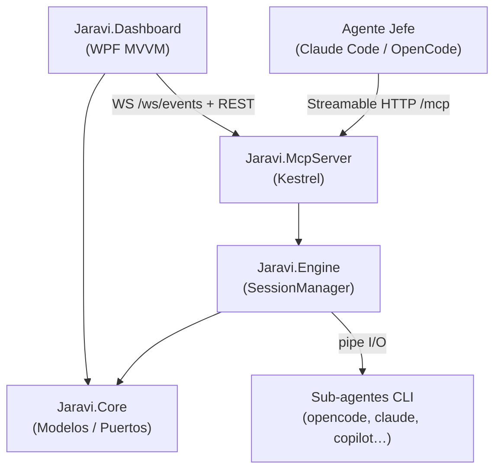

# Arquitectura

Jaravi sigue **Clean Architecture** con cuatro proyectos ensamblados jerárquicamente. Las dependencias apuntan siempre hacia adentro del núcleo.

## Principios

1. **Dominio puro** — `Jaravi.Core` no tiene dependencias externas. Define modelos (`SessionState`, `LogEntry`, `SpawnRequest`), eventos polimórficos y puertos (`ISessionManager`, `ILogStore`, `IEventBus`, `IAgentRegistry`).
2. **[[Motor (Engine)|Motor]]** implementa los puertos del Core. Contiene la lógica de sesiones, el bus de eventos, el [[Perfiles de Agentes|registro de agentes]], el ring buffer de logs y el [[Operacion|Scope Gate]].
3. **[[Servidor MCP]]** expone el motor mediante Kestrel. Ofrece 9 tools MCP, un endpoint WebSocket `/ws/events` para telemetría en vivo y una API REST `/api` para control y consulta.
4. **[[Dashboard]]** consume HTTP y WebSocket. Solo depende de `Jaravi.Core` (DTOs compartidos). Usa MVVM con CommunityToolkit.Mvvm y Catel.

## Garantías anti-colapso

- Ring buffer de 10 000 líneas por sesión + tope duro de lectura de 500 líneas.
- [[Operacion|Scope Gate]]: workdir validado contra `Engine:AllowedRoots`.
- Deadline duro por sesión con `Kill(entireProcessTree: true)`.
- Logs sanitizados sin secuencias ANSI mediante `AnsiSanitizer`.
